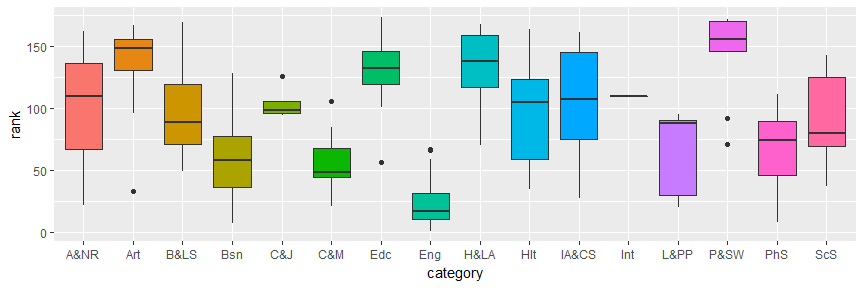

How income varies across college major categories
================
Maurício Collaça
Nov 1st 2017

The hyphotesis question
-----------------------

Is there an association between college major category and income?

Requirements
------------

    install.packages("devtools")
    devtools::install_github("jhudsl/collegeIncome")
    devtools::install_github("jhudsl/matahari")

``` r
library(collegeIncome)
data(college)
library(matahari)
library(ggplot2);library(GGally);library(dplyr)
```

Custom functions

``` r
wordwrap <- function(x, width = 10)
    lapply(strwrap(x, width = width, simplify = FALSE), paste, collapse="\n")
labelwrap <- function(x)
    gsub("_", " ", sub("perc_", "% ", x))
customtable <- function(x) 
    knitr::kable(x, col.names = labelwrap(names(x)), digits = 3)
pval <- function(x) {
    f <- summary(x)$f
    p <- pf(f[1], f[2], f[3], lower.tail = FALSE)
    attributes(p)<-NULL
    p
}
```

Data validations
----------------

A codebook for the dataset is given below:

-   rank: Rank by median earnings
-   major\_code: Major code
-   major: Major description
-   major\_category: Category of major
-   total: Total number of people with major
-   sample\_size: Sample size of full-time, year-round individuals used for income/earnings estimates: p25th, median, p75th
-   p25th: 25th percentile of earnings
-   median: Median earnings of full-time, year-round workers
-   p75th: 75th percentile of earnings
-   perc\_men: % men with major (out of total)
-   perc\_women: % women with major (out of total)
-   perc\_employed: % employed (out of total)
-   perc\_employed\_fulltime: % employed 35 hours or more (out of employed)
-   perc\_employed\_parttime: % employed less than 35 hours (out of employed)
-   perc\_employed\_fulltime\_yearround: % employed at least 50 weeks and at least 35 hours (out of employed and full-time)
-   perc\_unemployed: % unemployed (out of employed)
-   perc\_college\_jobs: % with job requiring a college degree (out of employed)
-   perc\_non\_college\_jobs: % with job not requiring a college degree (out of employed)
-   perc\_low\_wage\_jobs: % in low-wage service jobs (out of total)

### Generalized pairs plot of all numeric variables

There are some expected relatioships:

-   The sample size and total number of people with major are highly positive correlated.
-   The percent of woman and men are perfectly negative correlated.
-   The percent of employed and unemployed are perfectly negative correlated.

There are also unexpected relationships:

-   The rank is not strongly related with anything
-   The percent of employed fulltime can't be correlated, suggesting that Infinite values happened.
-   The percent of college jobs and non college jobs are not perfectly negative correlated which denotes miscalculations.

``` r
college %>%
    select(everything(), -c(2:4)) %>%
    ggpairs(cardinality_threshold = 16, columnLabels = labelwrap(names(.)))
```


### Each observation is a major

``` r
nrow(college)==length(unique(college$major))
```

    ## [1] TRUE

### Incomplete cases

``` r
NACols <- names(which(colSums(is.na(college)) > 0))
college %>%
    filter(!complete.cases(.)) %>%
    select(major_category, major_code, one_of(NACols)) %>%
    customtable
```

| major category          |  major code|  % employed parttime|  % college jobs|  % non college jobs|  % low wage jobs|
|:------------------------|-----------:|--------------------:|---------------:|-------------------:|----------------:|
| Engineering             |        2412|                  NaN|           0.205|               0.661|            0.137|
| Computers & Mathematics |        2100|                 0.24|             NaN|                 NaN|              NaN|

### Observations with invalid percents

A helper function to check whether the value is a wrong percent, assuming a range from 0 to 1, inclusive.

``` r
is.wrong <- function(x, min=0, max=1)
    is.na(x) | is.infinite(x) | (is.numeric(x) & (x < min | x > max))
```

Which columns have wrong values

``` r
columnScope <- grep("^perc_",names(college), value = TRUE)
(wrongCols <- names(which(colSums(sapply(college[, columnScope], is.wrong))>0)))
```

    ## [1] "perc_employed_fulltime" "perc_employed_parttime"
    ## [3] "perc_college_jobs"      "perc_non_college_jobs" 
    ## [5] "perc_low_wage_jobs"

Which rows have wrong values

``` r
wrongRows <- apply(sapply(wrongCols,
                          function(col) is.wrong(college[, col])),
                   1, any)
college %>%
    filter(wrongRows) %>%
    select(rank, major_category, major_code, one_of(wrongCols)) %>%
    customtable
```

|  rank| major category            |  major code|  % employed fulltime|  % employed parttime|  % college jobs|  % non college jobs|  % low wage jobs|
|-----:|:--------------------------|-----------:|--------------------:|--------------------:|---------------:|-------------------:|----------------:|
|    17| Engineering               |        2412|                  Inf|                  NaN|           0.205|               0.661|            0.137|
|    43| Computers & Mathematics   |        2100|                0.869|                0.240|             NaN|                 NaN|              NaN|
|    46| Computers & Mathematics   |        2105|                1.097|                0.142|           0.364|               0.563|            0.109|
|    58| Business                  |        6200|                1.043|                0.000|           0.313|               0.527|            0.148|
|    63| Business                  |        6299|                1.179|                0.231|           0.116|               0.464|            0.092|
|   134| Education                 |        2309|                1.045|                0.000|           0.663|               0.217|            0.067|
|   148| Education                 |        2306|                1.410|                0.198|           0.433|               0.502|            0.164|
|   168| Humanities & Liberal Arts |        3302|                1.004|                0.102|           0.680|               0.278|            0.087|

Invalid values such as `NaN` (not a number), `Inf` (infinite) and `NA` (missing) foster problems and bias in calculations. It's a best practice to get rid of them, as much as it makes sense, documenting those transformations for reproducibility purposes.

Also, percents must not be outside the range 0 to 1.

There's no raw data to recalculate the underlying percents.

As the hypothesis question is directly to the rank and not the percents, and, the ranks are perfectly uniform, it's assumed that a good strategy is not to remove incomplete observations but fix the wrong percents by their major category mean, or prefferably median, avoiding bias as and if the percents were taken as regression terms.

Data transformations
--------------------

### Category abbreviation

Abbreviate major category to fit in tiny spaces, e.g. axis labels report columns

``` r
college <- college %>%
    mutate(category = factor(abbreviate(major_category, minlength=3)))

college %>%
    select(category, major_category) %>%
    distinct %>%
    customtable
```

| category | major category                      |
|:---------|:------------------------------------|
| Eng      | Engineering                         |
| Bsn      | Business                            |
| PhS      | Physical Sciences                   |
| L&PP     | Law & Public Policy                 |
| C&M      | Computers & Mathematics             |
| A&NR     | Agriculture & Natural Resources     |
| IA&CS    | Industrial Arts & Consumer Services |
| Art      | Arts                                |
| Hlt      | Health                              |
| ScS      | Social Science                      |
| B&LS     | Biology & Life Science              |
| Edc      | Education                           |
| H&LA     | Humanities & Liberal Arts           |
| P&SW     | Psychology & Social Work            |
| C&J      | Communications & Journalism         |
| Int      | Interdisciplinary                   |

### Imputing median values

As the percents are originated from median statistics and in order to minimize bias, it's assumed the median is a better imputing value than the mean.

``` r
college <- college
for(col in seq_along(wrongCols)) {
    wrongColRows <- is.wrong(college[, wrongCols[col]])
    college[wrongColRows, wrongCols[col]] <- 
        median(college[!wrongColRows, wrongCols[col]])
}
```

Rows after imputation

``` r
college %>%
    filter(wrongRows) %>%
    select(rank, major_category, major_code, one_of(wrongCols)) %>%
    customtable
```

|  rank| major category            |  major code|  % employed fulltime|  % employed parttime|  % college jobs|  % non college jobs|  % low wage jobs|
|-----:|:--------------------------|-----------:|--------------------:|--------------------:|---------------:|-------------------:|----------------:|
|    17| Engineering               |        2412|                0.824|                0.286|           0.205|               0.661|            0.137|
|    43| Computers & Mathematics   |        2100|                0.869|                0.240|           0.416|               0.420|            0.109|
|    46| Computers & Mathematics   |        2105|                0.824|                0.142|           0.364|               0.563|            0.109|
|    58| Business                  |        6200|                0.824|                0.000|           0.313|               0.527|            0.148|
|    63| Business                  |        6299|                0.824|                0.231|           0.116|               0.464|            0.092|
|   134| Education                 |        2309|                0.824|                0.000|           0.663|               0.217|            0.067|
|   148| Education                 |        2306|                0.824|                0.198|           0.433|               0.502|            0.164|
|   168| Humanities & Liberal Arts |        3302|                0.824|                0.102|           0.680|               0.278|            0.087|

Exploratory Data Analysis
-------------------------

As stated in the codebook, the rank is calculated from median earnings of full-time, year-round workers, understood as the rank is the response variable and its main predictor is the median.

The following percents pairs are understood as complementary, i.e., each sum should result in 1 (100%):

    perc_men: % men with major (out of total)
    perc_women: % women with major (out of total)

    perc_employed: % employed (out of total)
    perc_unemployed: % unemployed (out of employed)

    perc_employed_fulltime: % employed 35 hours or more (out of employed)
    perc_employed_parttime: % employed less than 35 hours (out of employed)

    perc_college_jobs: % with job requiring a college degree (out of employed)
    perc_non_college_jobs: % with job not requiring a college degree (out of employed)

The following percents stand alone:

    perc_employed_fulltime_yearround: % employed at least 50 weeks and at least 35 hours (out of employed and full-time)
    perc_low_wage_jobs: % in low-wage service jobs (out of total)

These assumptions drive the following explorations.

### Generalized pairs plot of all numeric variables after imputing

After imputing data, the previoulsy expected relatioships remain:

-   The sample size and total number of people with major are highly positive correlated .
-   The percent of woman and men are perfectly negative correlated.
-   The percent of employed and unemployed are perfectly negative correlated.

After imputing data, the previously unexpected relationships changed but still remain:

-   The rank is not strongly related with any variable.
-   The percent of employed fulltime now can be correlated, however, it's not perfectly negative correlated with the percent of unemployed.
-   The percent of college jobs and non college jobs are not perfectly negative correlated as they weren't before.

``` r
college %>%
    select(everything(), -c(2:4,20)) %>%
    ggpairs(cardinality_threshold = 16, columnLabels = labelwrap(names(.)))
```


### Ranking reproducibility

Although the codebook states that the rank is by median earnings, it was not possible to reproduce it with the function `rank()`. It's found even an unexpected negative correlation between them. The analysis will continue without knowning the ranking process.

``` r
ggplot(college, aes(x=rank, y=rank(median))) +
    geom_point(aes(color=category)) +
    geom_smooth(method="lm")
```


### Median earning distribution

Comparing the distribution kernel density and the normal curve one can see that the distribution of the median earning of each major is not normally distributed.

``` r
x <- college$median
ggplot(college, aes(x=median), size=1) +
    geom_density(aes(color="Kernel"), fill="dark red", alpha=0.2) +
    stat_function(aes(color="Normal"), fun=dnorm, args=list(mean=mean(x), sd=sd(x))) +
    scale_color_manual("Density", values = c(Kernel="dark red", Normal="blue")) +
    geom_vline(aes(xintercept = median(x), linetype="Median")) +
    geom_vline(aes(xintercept = mean(x), linetype="Mean")) +
    scale_linetype_manual("Centrality", values = c(Median=1, Mean=2))
```


### Median earning by major category

There are potential influential points that deservers investigation.

``` r
ggplot(college, aes(y=median, x=category, fill=category)) +
    geom_boxplot(show.legend = FALSE)
```



The Interdisciplinary category has only one major, ranked bellow 100. As we cannot estimate effects of a category with a single major, it will be removed.

``` r
college <- college %>%
    filter(category != "Int")
```

``` r
ggplot(college, aes(y=median, x=category, fill=category)) +
    geom_violin() +
    geom_dotplot(binaxis='y', stackdir='center', fill="black",
                 dotsize=1.5, binwidth = 1000) +
    theme(legend.position = "none")
```


Regression inference
--------------------

The category t-values and their p-values that are all bigger than alpha mean not significant.

The model f-value and its p-value that is bigger than alpha mean not significant.

``` r
fit1 <- lm(median ~ category, college)
summary(fit1)
```

    ## 
    ## Call:
    ## lm(formula = median ~ category, data = college)
    ## 
    ## Residuals:
    ##    Min     1Q Median     3Q    Max 
    ## -20154  -6804  -2915   4837  60846 
    ## 
    ## Coefficients:
    ##               Estimate Std. Error t value Pr(>|t|)    
    ## (Intercept)    43500.0     3590.8  12.114   <2e-16 ***
    ## categoryArt    -5450.0     5386.2  -1.012   0.3132    
    ## categoryB&LS     364.3     4701.5   0.077   0.9383    
    ## categoryBsn     5653.8     4776.2   1.184   0.2383    
    ## categoryC&J    -1500.0     6717.8  -0.223   0.8236    
    ## categoryC&M    -8781.8     4961.4  -1.770   0.0787 .  
    ## categoryEdc    -5562.5     4577.4  -1.215   0.2261    
    ## categoryEng    -3106.9     4164.2  -0.746   0.4567    
    ## categoryH&LA   -8333.3     4635.7  -1.798   0.0742 .  
    ## categoryHlt    -3183.3     4862.0  -0.655   0.5136    
    ## categoryIA&CS  -3071.4     5595.9  -0.549   0.5839    
    ## categoryL&PP   -5700.0     6219.5  -0.916   0.3608    
    ## categoryP&SW   -3611.1     5217.3  -0.692   0.4899    
    ## categoryPhS    -3100.0     5078.2  -0.610   0.5424    
    ## categoryScS    -4433.3     5217.3  -0.850   0.3968    
    ## ---
    ## Signif. codes:  0 '***' 0.001 '**' 0.01 '*' 0.05 '.' 0.1 ' ' 1
    ## 
    ## Residual standard error: 11360 on 157 degrees of freedom
    ## Multiple R-squared:  0.09901,    Adjusted R-squared:  0.01867 
    ## F-statistic: 1.232 on 14 and 157 DF,  p-value: 0.257

``` r
anova(fit1)
```

    ## Analysis of Variance Table
    ## 
    ## Response: median
    ##            Df     Sum Sq   Mean Sq F value Pr(>F)
    ## category   14 2.2247e+09 158903742  1.2324  0.257
    ## Residuals 157 2.0244e+10 128939810

### Residual analysis

In the first plot there's some kind of undesired systematic pattern and three outlying observations.

In the second plot there is some violation in the normality assumption of the residuals.

**It's not a good model.**

``` r
par(mfrow=c(3,2))
plot(fit1, which = 1:6, cex.id = 1, col="dark gray")
```


### Outliers

Leverage measures (hat values) can be useful for diagnosing data entry errors and points that have a high potential for influence.

Influence measures explains how removing points impact a particular aspect of the model.

#### Influence measures

``` r
inf.measures <- influence.measures(fit1)
summary(inf.measures)
```

    ## Potentially influential observations of
    ##   lm(formula = median ~ category, data = college) :
    ## 
    ##     dfb.1_ dfb.ctgA dfb.cB&L dfb.ctgB dfb.cC&J dfb.cC&M dfb.ctgryEd
    ## 16   0.00   0.00     0.00     0.00     0.00     0.00     0.00      
    ## 20   0.00   0.00     0.00     0.00     0.00     0.00     0.00      
    ## 63   0.00   0.00     0.00     1.18_*   0.00     0.00     0.00      
    ## 81   0.00   0.00     0.52     0.00     0.00     0.00     0.00      
    ## 88   0.00   0.00     0.00     0.00     0.00     0.00     0.00      
    ## 90   0.00   0.00     0.00     0.00     0.00     0.00     0.00      
    ## 94   0.00   0.00     0.00     0.00     0.40     0.00     0.00      
    ## 95   0.00   0.00     0.00     0.00     0.00     0.00     0.00      
    ## 97   0.00   0.00     0.00     0.00     0.40     0.00     0.00      
    ## 99   0.00   0.00     0.00     0.00    -0.45     0.00     0.00      
    ## 125  0.00   0.00     0.00     0.00    -0.35     0.00     0.00      
    ##     dfb.ctgryEn dfb.cH&L dfb.ctgH dfb.cIA& dfb.cL&P dfb.cP&S dfb.ctPS
    ## 16   0.29        0.00     0.00     0.00     0.00     0.00     0.00   
    ## 20   0.00        0.00     0.00     0.00     0.09     0.00     0.00   
    ## 63   0.00        0.00     0.00     0.00     0.00     0.00     0.00   
    ## 81   0.00        0.00     0.00     0.00     0.00     0.00     0.00   
    ## 88   0.00        0.00     0.00     0.00    -0.27     0.00     0.00   
    ## 90   0.00        0.00     0.00     0.00    -0.31     0.00     0.00   
    ## 94   0.00        0.00     0.00     0.00     0.00     0.00     0.00   
    ## 95   0.00        0.00     0.00     0.00    -0.11     0.00     0.00   
    ## 97   0.00        0.00     0.00     0.00     0.00     0.00     0.00   
    ## 99   0.00        0.00     0.00     0.00     0.00     0.00     0.00   
    ## 125  0.00        0.00     0.00     0.00     0.00     0.00     0.00   
    ##     dfb.ctSS dffit   cov.r   cook.d hat  
    ## 16   0.00     0.57    0.49_*  0.02   0.03
    ## 20   0.00     0.11    1.37_*  0.00   0.20
    ## 63   0.00     1.79_*  0.04_*  0.17   0.08
    ## 81   0.00     0.81    0.54_*  0.04   0.07
    ## 88   0.00    -0.33    1.32_*  0.01   0.20
    ## 90   0.00    -0.38    1.30_*  0.01   0.20
    ## 94   0.00     0.47    1.38_*  0.01   0.25
    ## 95   0.00    -0.14    1.37_*  0.00   0.20
    ## 97   0.00     0.47    1.38_*  0.01   0.25
    ## 99   0.00    -0.53    1.35_*  0.02   0.25
    ## 125  0.00    -0.41    1.40_*  0.01   0.25

#### Influential observations

``` r
influential <- unname(apply(inf.measures$is.inf, 1, any))
college %>%
    select(category, major_code, major, total, sample_size, median, rank) %>%
    filter(influential) %>% customtable()
```

| category |  major code| major                                           |   total|  sample size|  median|  rank|
|:---------|-----------:|:------------------------------------------------|-------:|------------:|-------:|-----:|
| Eng      |        2402| Biological Engineering                          |    8925|           55|   73000|    16|
| L&PP     |        3201| Court Reporting                                 |    1148|           14|   40000|    20|
| Bsn      |        6299| Miscellaneous Business & Medical Administration |   17947|          244|  110000|    63|
| B&LS     |        3606| Microbiology                                    |   15232|           62|   75000|    81|
| L&PP     |        3202| Pre-Law And Legal Studies                       |   13528|           92|   31000|    88|
| L&PP     |        5401| Public Administration                           |    5629|           46|   30000|    90|
| C&J      |        1901| Communications                                  |  213996|         2394|   50000|    94|
| L&PP     |        5301| Criminal Justice And Fire Protection            |  152824|         1728|   35000|    95|
| C&J      |        1902| Journalism                                      |   72619|          843|   50000|    97|
| C&J      |        1904| Advertising And Public Relations                |   53162|          681|   33000|    99|
| C&J      |        1903| Mass Media                                      |   52824|          590|   35000|   126|

#### What-if removing influential observations?

According to the model p-value, it's an even worse model.

``` r
college2 <- college %>% filter(!influential)
anova(lm(median ~ category, college2))
```

    ## Analysis of Variance Table
    ## 
    ## Response: median
    ##            Df     Sum Sq  Mean Sq F value Pr(>F)
    ## category   13 1.2610e+09 97001751  1.0579 0.4003
    ## Residuals 147 1.3479e+10 91692439

### Adding other terms

One can experiment adding other terms not correlated to category like gender effects and effects related to type of job (jobs requiring a college degree and jobs that are low-wage service positions).

``` r
fit2 <- lm(median ~ category + perc_women, college)
fit3 <- lm(median ~ category + perc_college_jobs, college)
fit4 <- lm(median ~ category + perc_low_wage_jobs, college)
```

``` r
anova(fit1, fit2)
```

    ## Analysis of Variance Table
    ## 
    ## Model 1: median ~ category
    ## Model 2: median ~ category + perc_women
    ##   Res.Df        RSS Df Sum of Sq      F Pr(>F)
    ## 1    157 2.0244e+10                           
    ## 2    156 2.0034e+10  1 210042153 1.6356 0.2028

``` r
anova(fit1, fit3)
```

    ## Analysis of Variance Table
    ## 
    ## Model 1: median ~ category
    ## Model 2: median ~ category + perc_college_jobs
    ##   Res.Df        RSS Df Sum of Sq      F  Pr(>F)  
    ## 1    157 2.0244e+10                              
    ## 2    156 1.9849e+10  1 394264755 3.0986 0.08032 .
    ## ---
    ## Signif. codes:  0 '***' 0.001 '**' 0.01 '*' 0.05 '.' 0.1 ' ' 1

``` r
anova(fit1, fit4)
```

    ## Analysis of Variance Table
    ## 
    ## Model 1: median ~ category
    ## Model 2: median ~ category + perc_low_wage_jobs
    ##   Res.Df        RSS Df Sum of Sq      F Pr(>F)
    ## 1    157 2.0244e+10                           
    ## 2    156 2.0131e+10  1 112364196 0.8707 0.3522

No significant improvement in the model.
