How income varies across college major categories
================
Maurício Collaça
Nov 1st 2017

The hyphotesis question
-----------------------

Is there an association between college major category and income?

Requirements
------------

    install.packages("devtools")
    devtools::install_github("jhudsl/collegeIncome")
    devtools::install_github("jhudsl/matahari")

``` r
library(collegeIncome)
data(college)
library(matahari)
library(ggplot2);library(GGally);library(dplyr)
```

Custom functions

``` r
wordwrap <- function(x, width = 10)
    lapply(strwrap(x, width = width, simplify = FALSE), paste, collapse="\n")
labelwrap <- function(x)
    gsub("_", " ", sub("perc_", "% ", x))
customtable <- function(x) 
    knitr::kable(x, col.names = labelwrap(names(x)), digits = 3)
pval <- function(x) {
    f <- summary(x)$f
    p <- pf(f[1], f[2], f[3], lower.tail = FALSE)
    attributes(p)<-NULL
    p
}
```

Data validations
----------------

A codebook for the dataset is given below:

-   rank: Rank by median earnings
-   major\_code: Major code
-   major: Major description
-   major\_category: Category of major
-   total: Total number of people with major
-   sample\_size: Sample size of full-time, year-round individuals used for income/earnings estimates: p25th, median, p75th
-   p25th: 25th percentile of earnings
-   median: Median earnings of full-time, year-round workers
-   p75th: 75th percentile of earnings
-   perc\_men: % men with major (out of total)
-   perc\_women: % women with major (out of total)
-   perc\_employed: % employed (out of total)
-   perc\_employed\_fulltime: % employed 35 hours or more (out of employed)
-   perc\_employed\_parttime: % employed less than 35 hours (out of employed)
-   perc\_employed\_fulltime\_yearround: % employed at least 50 weeks and at least 35 hours (out of employed and full-time)
-   perc\_unemployed: % unemployed (out of employed)
-   perc\_college\_jobs: % with job requiring a college degree (out of employed)
-   perc\_non\_college\_jobs: % with job not requiring a college degree (out of employed)
-   perc\_low\_wage\_jobs: % in low-wage service jobs (out of total)

### Generalized pairs plot of all numeric variables

There are some expected relatioships:

-   The sample size and total number of people with major are highly positive correlated.
-   The percent of woman and men are perfectly negative correlated.
-   The percent of employed and unemployed are perfectly negative correlated.

There are also unexpected relationships:

-   The rank is not strongly related with anything
-   The percent of employed fulltime can't be correlated, suggesting that Infinite values happened.
-   The percent of college jobs and non college jobs are not perfectly negative correlated which denotes miscalculations.

``` r
college %>%
    select(everything(), -c(2:4)) %>%
    ggpairs(cardinality_threshold = 16, columnLabels = labelwrap(names(.)))
```

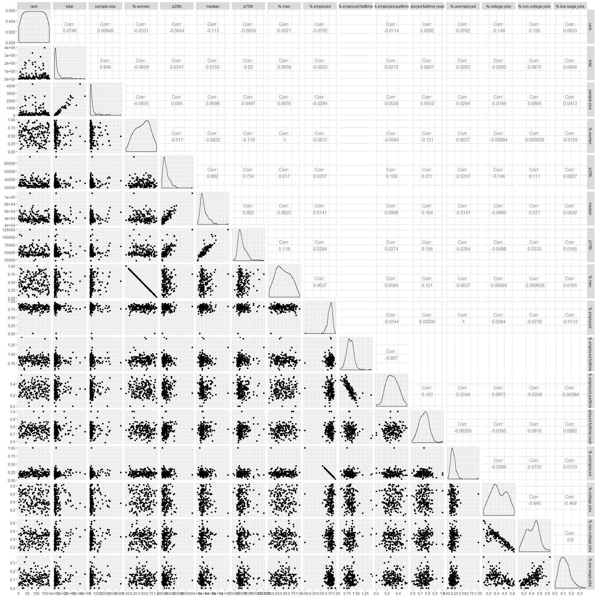

### Each observation is a major

``` r
nrow(college)==length(unique(college$major))
```

    ## [1] TRUE

### Rank uniformity and discreteness

``` r
all(sort(college$rank) == 1:nrow(college))
```

    ## [1] TRUE

### Incomplete cases

``` r
NACols <- names(which(colSums(is.na(college)) > 0))
college %>%
    filter(!complete.cases(.)) %>%
    select(major_category, major_code, one_of(NACols)) %>%
    customtable
```

| major category          |  major code|  % employed parttime|  % college jobs|  % non college jobs|  % low wage jobs|
|:------------------------|-----------:|--------------------:|---------------:|-------------------:|----------------:|
| Engineering             |        2412|                  NaN|           0.205|               0.661|            0.137|
| Computers & Mathematics |        2100|                 0.24|             NaN|                 NaN|              NaN|

### Observations with invalid percents

A helper function to check whether the value is a wrong percent, assuming a range from 0 to 1, inclusive.

``` r
is.wrong <- function(x, min=0, max=1) is.na(x) | is.infinite(x) | (is.numeric(x) & (x < min | x > max))
```

Which columns have wrong values

``` r
(wrongCols <- names(which(colSums(sapply(college[, grep("^perc_",names(college), value = TRUE)], is.wrong))>0)))
```

    ## [1] "perc_employed_fulltime" "perc_employed_parttime"
    ## [3] "perc_college_jobs"      "perc_non_college_jobs" 
    ## [5] "perc_low_wage_jobs"

Which rows have wrong values

``` r
wrongRows <- apply(sapply(wrongCols, function(col) is.wrong(college[, col])), 1, any)
college %>%
    filter(wrongRows) %>%
    select(rank, major_category, major_code, one_of(wrongCols)) %>%
    customtable
```

|  rank| major category            |  major code|  % employed fulltime|  % employed parttime|  % college jobs|  % non college jobs|  % low wage jobs|
|-----:|:--------------------------|-----------:|--------------------:|--------------------:|---------------:|-------------------:|----------------:|
|    17| Engineering               |        2412|                  Inf|                  NaN|           0.205|               0.661|            0.137|
|    43| Computers & Mathematics   |        2100|                0.869|                0.240|             NaN|                 NaN|              NaN|
|    46| Computers & Mathematics   |        2105|                1.097|                0.142|           0.364|               0.563|            0.109|
|    58| Business                  |        6200|                1.043|                0.000|           0.313|               0.527|            0.148|
|    63| Business                  |        6299|                1.179|                0.231|           0.116|               0.464|            0.092|
|   134| Education                 |        2309|                1.045|                0.000|           0.663|               0.217|            0.067|
|   148| Education                 |        2306|                1.410|                0.198|           0.433|               0.502|            0.164|
|   168| Humanities & Liberal Arts |        3302|                1.004|                0.102|           0.680|               0.278|            0.087|

Invalid values such as `NaN` (not a number), `Inf` (infinite) and `NA` (missing) foster problems and bias in calculations. It's a best practice to get rid of them, as much as it makes sense, documenting those transformations for reproducibility purposes.

Also, percents must not be outside the range 0 to 1.

There's no raw data to recalculate the underlying percents.

As the hypothesis question is directly to the rank and not the percents, and, the ranks are perfectly uniform, it's assumed that a good strategy is not to remove incomplete observations but fix the wrong percents by their major category mean, or prefferably median, avoiding bias as and if the percents were taken as regression terms.

Data transformations
--------------------

### Category abbreviation

Abbreviate major category to fit in tiny spaces, e.g. axis labels report columns

``` r
college <- college %>%
    mutate(category = factor(abbreviate(major_category, minlength=3)))

college %>%
    select(category, major_category) %>%
    distinct %>%
    customtable
```

| category | major category                      |
|:---------|:------------------------------------|
| Eng      | Engineering                         |
| Bsn      | Business                            |
| PhS      | Physical Sciences                   |
| L&PP     | Law & Public Policy                 |
| C&M      | Computers & Mathematics             |
| A&NR     | Agriculture & Natural Resources     |
| IA&CS    | Industrial Arts & Consumer Services |
| Art      | Arts                                |
| Hlt      | Health                              |
| ScS      | Social Science                      |
| B&LS     | Biology & Life Science              |
| Edc      | Education                           |
| H&LA     | Humanities & Liberal Arts           |
| P&SW     | Psychology & Social Work            |
| C&J      | Communications & Journalism         |
| Int      | Interdisciplinary                   |

### Imputing median values

As the percents are originated from median statistics and in order to minimize bias, it's assumed the median is a better imputing value than the mean.

``` r
college <- college
for(col in seq_along(wrongCols)) {
    wrongColRows <- is.wrong(college[, wrongCols[col]])
    college[wrongColRows, wrongCols[col]] <- 
        median(college[!wrongColRows, wrongCols[col]])
}
```

Rows after imputation

``` r
college %>%
    filter(wrongRows) %>%
    select(rank, major_category, major_code, one_of(wrongCols)) %>%
    customtable
```

|  rank| major category            |  major code|  % employed fulltime|  % employed parttime|  % college jobs|  % non college jobs|  % low wage jobs|
|-----:|:--------------------------|-----------:|--------------------:|--------------------:|---------------:|-------------------:|----------------:|
|    17| Engineering               |        2412|                0.824|                0.286|           0.205|               0.661|            0.137|
|    43| Computers & Mathematics   |        2100|                0.869|                0.240|           0.416|               0.420|            0.109|
|    46| Computers & Mathematics   |        2105|                0.824|                0.142|           0.364|               0.563|            0.109|
|    58| Business                  |        6200|                0.824|                0.000|           0.313|               0.527|            0.148|
|    63| Business                  |        6299|                0.824|                0.231|           0.116|               0.464|            0.092|
|   134| Education                 |        2309|                0.824|                0.000|           0.663|               0.217|            0.067|
|   148| Education                 |        2306|                0.824|                0.198|           0.433|               0.502|            0.164|
|   168| Humanities & Liberal Arts |        3302|                0.824|                0.102|           0.680|               0.278|            0.087|

Exploratory Data Analysis
-------------------------

As stated in the codebook, the rank is calculated from median earnings of full-time, year-round workers, understood as the rank is the response variable and its main predictor is the median.

The following percents pairs are understood as complementary, i.e., each sum should result in 1 (100%):

    perc_men: % men with major (out of total)
    perc_women: % women with major (out of total)

    perc_employed: % employed (out of total)
    perc_unemployed: % unemployed (out of employed)

    perc_employed_fulltime: % employed 35 hours or more (out of employed)
    perc_employed_parttime: % employed less than 35 hours (out of employed)

    perc_college_jobs: % with job requiring a college degree (out of employed)
    perc_non_college_jobs: % with job not requiring a college degree (out of employed)

The following percents stand alone:

    perc_employed_fulltime_yearround: % employed at least 50 weeks and at least 35 hours (out of employed and full-time)
    perc_low_wage_jobs: % in low-wage service jobs (out of total)

These assumptions drive the following explorations.

### Generalized pairs plot of all numeric variables after imputing

After imputing data, the previoulsy expected relatioships remain:

-   The sample size and total number of people with major are highly positive correlated .
-   The percent of woman and men are perfectly negative correlated.
-   The percent of employed and unemployed are perfectly negative correlated.

After imputing data, the previously unexpected relationships changed but still remain:

-   The rank is not strongly related with any variable.
-   The percent of employed fulltime now can be correlated, however, it's not perfectly negative correlated with the percent of unemployed.
-   The percent of college jobs and non college jobs are not perfectly negative correlated as they weren't before.

``` r
college %>%
    select(everything(), -c(2:4,20)) %>%
    ggpairs(cardinality_threshold = 16, columnLabels = labelwrap(names(.)))
```

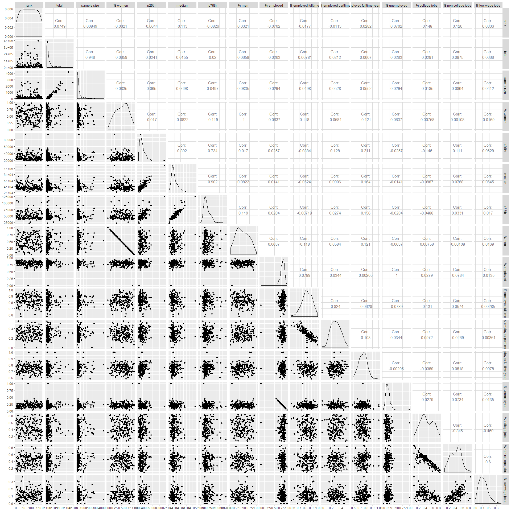

### Ranking reproducibility

Although the codebook states that the rank is by median earnings, it was not possible to reproduce it with the function `rank()`. It's found even an unexpected negative correlation between them. The analysis will continue without knowning the ranking process.

``` r
ggplot(college, aes(x=rank, y=rank(median))) +
    geom_point(aes(color=category)) +
    geom_smooth(method="lm")
```


### Rank by major category

The box plot shows the best ranked majors are from Engineering and the worst from Psychology & Social Work.

The Interdisciplinary category has only one major, ranked bellow 100. As we cannot estimate effects of a category with a single major, it will be removed.

``` r
college <- college %>%
    filter(category != "Int")
```

``` r
ggplot(college, aes(y=rank, x=category, fill=category)) +
    geom_boxplot(show.legend = FALSE)
```


The violin plot overlaid with a dot plot give a better view of the rank distribution by category. It suggests:

-   Engineering (Eng) ranks are more concentrated above 25, followed by Computers & Mathematics (C&M) more concentrated around 50..
-   Communications & Journalism (C&J) ranks are concentrated slightly above 100.
-   Categories "Art" and "Psychology & Social Work" have ranks more concentrated around 150.
-   The other categories not mentioned above are more uniformly distributed but worth metion that the categories Business (Bsn) and Physical Sciences (PhS) have each one a major that is around the overall top ones.

``` r
ggplot(college, aes(y=rank, x=category, fill=category)) +
    geom_violin(show.legend = FALSE) +
    geom_dotplot(binaxis='y', stackdir='center', fill="black",
                 dotsize=.6, binwidth = 5)
```

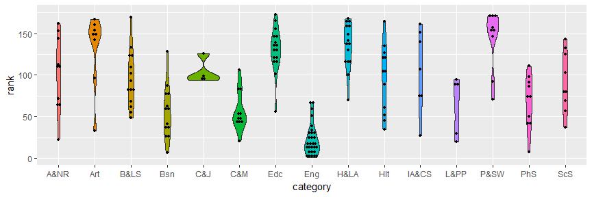

### Median earning distribution

As stated in the codebook, the rank is calculated from median earnings of full-time, year-round workers, therefore, this variable should be investigated.

Comparing the distribution kernel density and the normal curve one can see that the distribution of the median earning of each major is not normally distributed.

``` r
x <- college$median
ggplot(college, aes(x=median), size=1) +
    geom_density(aes(color="Kernel"), fill="dark red", alpha=0.2) +
    stat_function(aes(color="Normal"), fun=dnorm, args=list(mean=mean(x), sd=sd(x))) +
    scale_color_manual("Density", values = c(Kernel="dark red", Normal="blue")) +
    geom_vline(aes(xintercept = median(x), linetype="Median")) +
    geom_vline(aes(xintercept = mean(x), linetype="Mean")) +
    scale_linetype_manual("Centrality", values = c(Median=1, Mean=2))
```

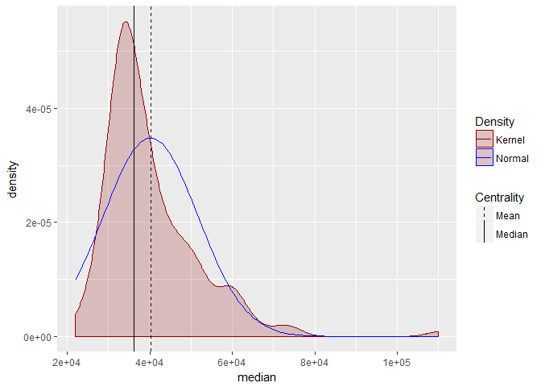

### Median earning by major category

As stated in the codebook, the Rank is calculated from median earnings of full-time, year-round workers, therefore, the distribution of median income by category is an interesting exploration.

There are potential influential points that deservers investigation.

``` r
ggplot(college, aes(y=median, x=category, fill=category)) +
    geom_boxplot(show.legend = FALSE)
```

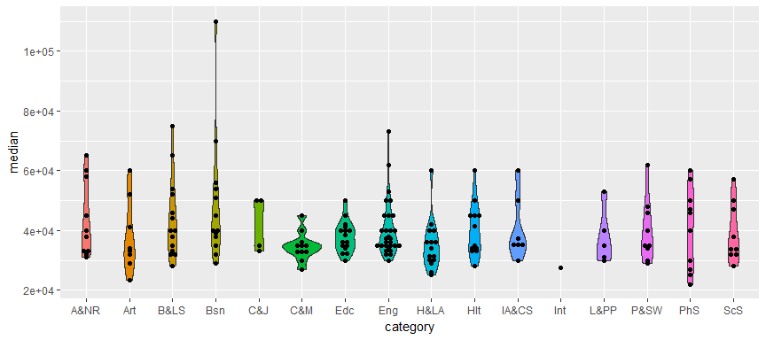

``` r
ggplot(college, aes(y=median, x=category, fill=category)) +
    geom_violin() +
    geom_dotplot(binaxis='y', stackdir='center', fill="black",
                 dotsize=1.5, binwidth = 1000) +
    theme(legend.position = "none")
```

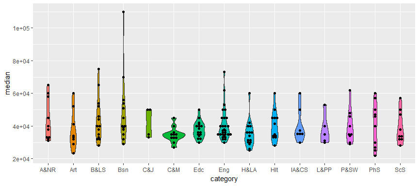

### Rank by median incoming

It's already detected the presence of outliers.

As stated in the codebook, the Rank is predicted by median earnings of full-time, year-round workers, therefore, it's important to understand the relationship between rank and median earning.

The overall regression line (black) suggests the higher the median earning the higher (low order) the rank.

The slope sign inversions suggests further investigation.

``` r
college %>% 
    ggplot(aes(y=rank, x=median, color=category)) +
    geom_point() +
    geom_smooth(method = "lm", se = FALSE) +
    geom_smooth(aes(color=NULL), color="black", method = "lm")
```

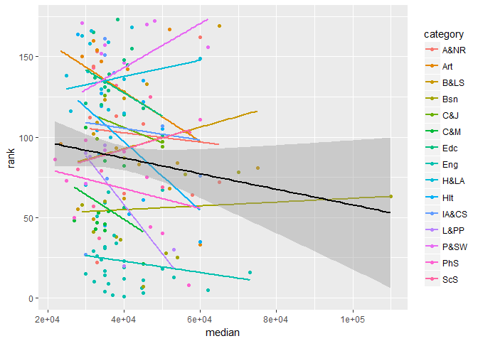

One can see the top 10 median earnings and respective ranks. The major "Miscellaneous Business & Medical Administration" have much higher median earning than the other majors but figures at 63rd in the rank while the major "Chemical Engineering" figures at 5th in the rank but with a much lower median earning.

``` r
college %>%
    arrange(desc(median)) %>%
    slice(1:10) %>%
    select(category, major_code, major, total, sample_size, median, rank) %>%
    customtable()
```

| category |  major code| major                                           |   total|  sample size|  median|  rank|
|:---------|-----------:|:------------------------------------------------|-------:|------------:|-------:|-----:|
| Bsn      |        6299| Miscellaneous Business & Medical Administration |   17947|          244|  110000|    63|
| B&LS     |        3606| Microbiology                                    |   15232|           62|   75000|    81|
| Eng      |        2402| Biological Engineering                          |    8925|           55|   73000|    16|
| Bsn      |        6206| Marketing And Marketing Research                |  205211|         2684|   70000|    78|
| A&NR     |        1102| Agricultural Economics                          |    2439|           44|   65000|    72|
| B&LS     |        3609| Zoology                                         |    8409|           47|   65000|   169|
| Eng      |        2405| Chemical Engineering                            |   32260|          289|   62000|     5|
| P&SW     |        5299| Miscellaneous Psychology                        |    9628|           60|   62000|   156|
| Art      |        6099| Miscellaneous Fine Arts                         |    3340|           30|   60000|    33|
| Hlt      |        6107| Nursing                                         |  209394|         2554|   60000|    35|

Without the raw data, one can't ensure wheter outliers are results from spurious or real process, however, residual analysis is recommended in order to measure influence.

### Rank by median earning conditioned by correlation sign

To eventually avoid or at least isolate a Sympson paradox, the relationship between the rank and the median earning is conditioned by the correlation sign. It's important to remind that a negative correlation, in this case, means a higher rank (low order) position.

The right-side overall regression line (black) seems to better isolate the Sympson Paradox between 5 categories and still shows the previously mentioned influential values. Within those categories, the more the median incomig increases, the lower is the rank (high order), i.e., those categories have unexpected positive correlations between the rank and the median however altogether result in the expected negative correlation.

``` r
college %>%
    group_by(category) %>%
    mutate(correlation_signal = sign(cor(rank, median))) %>%
    ungroup %>%
    filter(!is.na(correlation_signal)) %>%
    ggplot(aes(y=rank, x=median, color=category)) +
    facet_grid(. ~ correlation_signal) +
    geom_point() +
    geom_smooth(method = "lm", se = FALSE) +
    geom_smooth(aes(color=NULL), color="black", method = "lm")
```

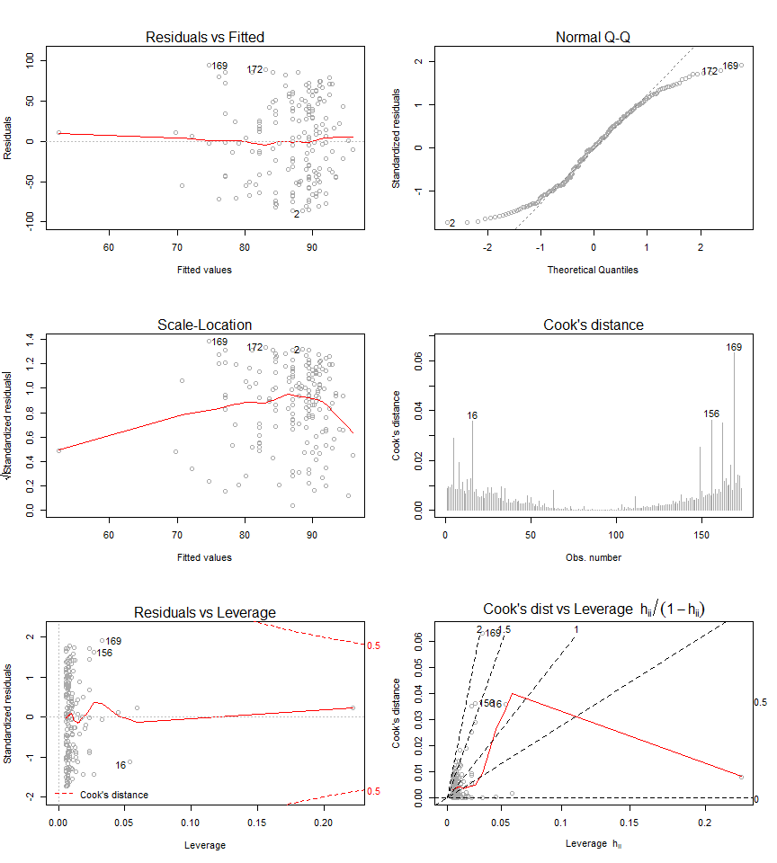

Note: the category "Int" (Interdisciplinary) had only one observation thus can't be correlated, thus removed from the plot above with `filter(!is.na(correlation_signal))`.

### Outliers

Leverage measures (hat values) can be useful for diagnosing data entry errors and points that have a high potential for influence.

Influence measures explains how removing points impact a particular aspect of the model.

#### Residual plots

In the first plot there's some kind of undesired systematic pattern and three outlying observations.

In the second plot there is a violation in the normality assumption of the residuals.

``` r
par(mfrow=c(3,2))
plot(lm(rank ~ median, college),
     which = 1:6, cex.id = 1, col="dark gray")
```

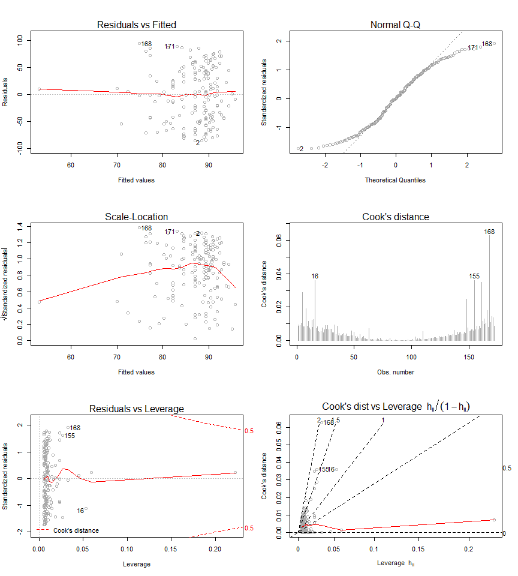

#### Influence measures

``` r
rankByMedianModel <- lm(rank ~ median, college)
rankByMedianMeasures <- influence.measures(rankByMedianModel)
summary(rankByMedianMeasures)
```

    ## Potentially influential observations of
    ##   lm(formula = rank ~ median, data = college) :
    ## 
    ##     dfb.1_ dfb.medn dffit   cov.r   cook.d hat    
    ## 16   0.22  -0.25    -0.27    1.05_*  0.04   0.05_*
    ## 63  -0.11   0.12     0.12    1.30_*  0.01   0.22_*
    ## 72   0.01  -0.01    -0.01    1.05_*  0.00   0.03  
    ## 76   0.00   0.00     0.00    1.04_*  0.00   0.02  
    ## 78  -0.02   0.02     0.02    1.06_*  0.00   0.05_*
    ## 81  -0.05   0.05     0.06    1.08_*  0.00   0.06_*
    ## 168 -0.27   0.32     0.36_*  1.00    0.06   0.03

#### Influential observations

``` r
influential <- unname(apply(rankByMedianMeasures$is.inf, 1, any))
college %>%
    select(category, major_code, major, total, sample_size, median, rank) %>%
    filter(influential) %>% customtable()
```

| category |  major code| major                                                             |   total|  sample size|  median|  rank|
|:---------|-----------:|:------------------------------------------------------------------|-------:|------------:|-------:|-----:|
| Eng      |        2402| Biological Engineering                                            |    8925|           55|   73000|    16|
| Bsn      |        6299| Miscellaneous Business & Medical Administration                   |   17947|          244|  110000|    63|
| A&NR     |        1102| Agricultural Economics                                            |    2439|           44|   65000|    72|
| IA&CS    |        5701| Electrical, Mechanical, And Precision Technologies And Production |    2435|           37|   60000|    76|
| Bsn      |        6206| Marketing And Marketing Research                                  |  205211|         2684|   70000|    78|
| B&LS     |        3606| Microbiology                                                      |   15232|           62|   75000|    81|
| B&LS     |        3609| Zoology                                                           |    8409|           47|   65000|   169|

#### What-if removing influential observations

``` r
which(influential)
```

    ## [1]  16  63  72  76  78  81 168

Removing the influential observations avoided the Sysmpson paradox in the correlation sign which suggests an improved model fit.

``` r
college %>%
    filter(!influential) %>%
    group_by(category) %>%
    mutate(correlation_signal = sign(cor(rank, median))) %>%
    ungroup %>%
    filter(!is.na(correlation_signal)) %>%
    ggplot(aes(y=rank, x=median, color=category)) +
    facet_grid(. ~ correlation_signal) +
    geom_point() +
    geom_smooth(method = "lm", se = FALSE) +
    geom_smooth(aes(color=NULL), color="black", method = "lm")
```

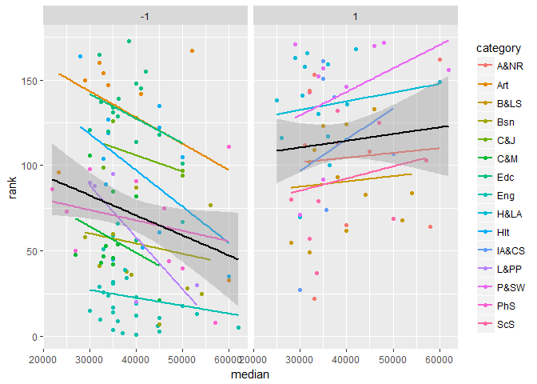

Regression inference
--------------------

### The initial hypothesis model

``` r
fit1 <- lm(rank ~ category, college)
summary(fit1)
```


    Call:
    lm(formula = rank ~ category, data = college)

    Residuals:
        Min      1Q  Median      3Q     Max 
    -98.125 -17.901   1.618  23.400  73.643 

    Coefficients:
                  Estimate Std. Error t value Pr(>|t|)    
    (Intercept)    101.500     10.269   9.884  < 2e-16 ***
    categoryArt     29.625     15.404   1.923  0.05626 .  
    categoryB&LS    -6.143     13.446  -0.457  0.64840    
    categoryBsn    -45.654     13.659  -3.342  0.00104 ** 
    categoryC&J      2.500     19.212   0.130  0.89663    
    categoryC&M    -44.500     14.189  -3.136  0.00204 ** 
    categoryEdc     28.875     13.091   2.206  0.02885 *  
    categoryEng    -78.879     11.909  -6.624 5.29e-10 ***
    categoryH&LA    33.567     13.258   2.532  0.01233 *  
    categoryHlt     -5.000     13.905  -0.360  0.71964    
    categoryIA&CS    3.643     16.004   0.228  0.82023    
    categoryL&PP   -36.900     17.787  -2.075  0.03966 *  
    categoryP&SW    41.500     14.921   2.781  0.00608 ** 
    categoryPhS    -33.900     14.523  -2.334  0.02085 *  
    categoryScS     -9.833     14.921  -0.659  0.51084    
    ---
    Signif. codes:  0 '***' 0.001 '**' 0.01 '*' 0.05 '.' 0.1 ' ' 1

    Residual standard error: 32.47 on 157 degrees of freedom
    Multiple R-squared:  0.6158,    Adjusted R-squared:  0.5815 
    F-statistic: 17.97 on 14 and 157 DF,  p-value: < 2.2e-16

``` r
par(mfrow=c(3,2))
plot(fit1, which = 1:6, cex.id = 1, col="dark gray")
```

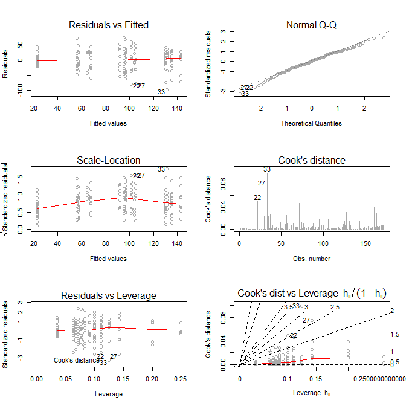

### Adding other terms

As stated in the codebook, the rank is calculated from median earnings of full-time, year-round workers, therefore, we can experiment other terms not related to them like gender effects and effects related to type of job (jobs requiring a college degree and jobs that are low-wage service positions).

``` r
fit2 <- lm(rank ~ major_category + perc_women + perc_college_jobs +
              perc_low_wage_jobs, college)
summary(fit2)
```


    Call:
    lm(formula = rank ~ major_category + perc_women + perc_college_jobs + 
        perc_low_wage_jobs, data = college)

    Residuals:
        Min      1Q  Median      3Q     Max 
    -93.952 -18.995   0.053  22.141  67.892 

    Coefficients:
                                                      Estimate Std. Error
    (Intercept)                                        126.727     16.090
    major_categoryArts                                  27.678     15.490
    major_categoryBiology & Life Science                -7.188     13.599
    major_categoryBusiness                             -48.225     13.812
    major_categoryCommunications & Journalism            1.787     19.269
    major_categoryComputers & Mathematics              -48.627     14.296
    major_categoryEducation                             28.381     13.085
    major_categoryEngineering                          -80.086     11.928
    major_categoryHealth                                -7.872     13.909
    major_categoryHumanities & Liberal Arts             30.337     13.427
    major_categoryIndustrial Arts & Consumer Services    4.410     15.973
    major_categoryLaw & Public Policy                  -40.920     18.167
    major_categoryPhysical Sciences                    -36.612     14.562
    major_categoryPsychology & Social Work              35.522     15.219
    major_categorySocial Science                        -7.982     15.067
    perc_women                                          -7.604     11.243
    perc_college_jobs                                  -31.388     15.057
    perc_low_wage_jobs                                 -46.346     45.651
                                                      t value Pr(>|t|)    
    (Intercept)                                         7.876 5.65e-13 ***
    major_categoryArts                                  1.787 0.075929 .  
    major_categoryBiology & Life Science               -0.529 0.597851    
    major_categoryBusiness                             -3.491 0.000627 ***
    major_categoryCommunications & Journalism           0.093 0.926214    
    major_categoryComputers & Mathematics              -3.401 0.000854 ***
    major_categoryEducation                             2.169 0.031618 *  
    major_categoryEngineering                          -6.714 3.43e-10 ***
    major_categoryHealth                               -0.566 0.572256    
    major_categoryHumanities & Liberal Arts             2.259 0.025259 *  
    major_categoryIndustrial Arts & Consumer Services   0.276 0.782865    
    major_categoryLaw & Public Policy                  -2.252 0.025712 *  
    major_categoryPhysical Sciences                    -2.514 0.012956 *  
    major_categoryPsychology & Social Work              2.334 0.020888 *  
    major_categorySocial Science                       -0.530 0.597056    
    perc_women                                         -0.676 0.499853    
    perc_college_jobs                                  -2.085 0.038761 *  
    perc_low_wage_jobs                                 -1.015 0.311591    
    ---
    Signif. codes:  0 '***' 0.001 '**' 0.01 '*' 0.05 '.' 0.1 ' ' 1

    Residual standard error: 32.29 on 154 degrees of freedom
    Multiple R-squared:  0.6274,    Adjusted R-squared:  0.5863 
    F-statistic: 15.26 on 17 and 154 DF,  p-value: < 2.2e-16

``` r
par(mfrow=c(3,2))
plot(fit2, which = 1:6, cex.id = 1, col="dark gray")
```

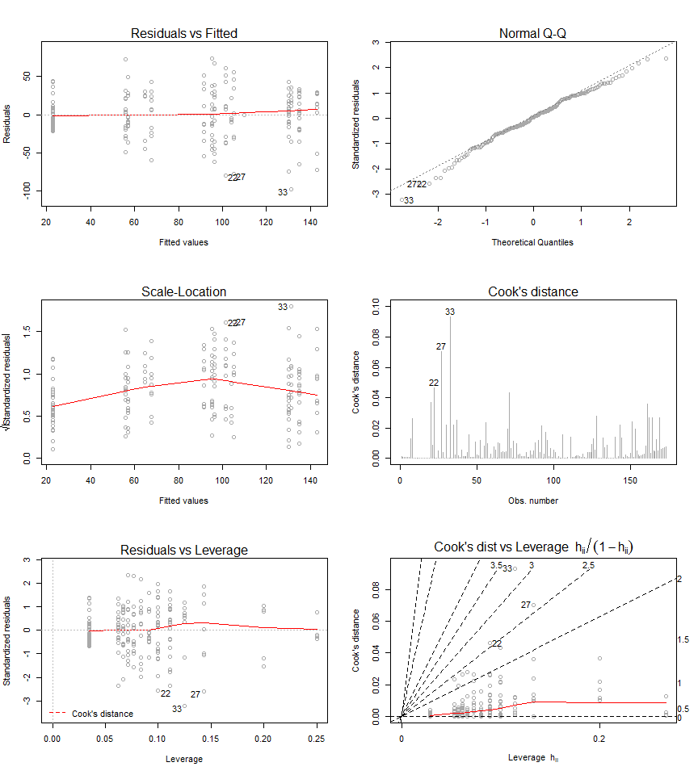

### Model ANOVA

``` r
anova(fit1, fit2)
```

    ## Analysis of Variance Table
    ## 
    ## Model 1: rank ~ category
    ## Model 2: rank ~ major_category + perc_women + perc_college_jobs + perc_low_wage_jobs
    ##   Res.Df    RSS Df Sum of Sq      F Pr(>F)
    ## 1    157 165569                           
    ## 2    154 160553  3    5015.8 1.6037 0.1908

### Model 1 influence measurements and influential observations

``` r
measures <- influence.measures(fit1)
summary(measures)
```

    ## Potentially influential observations of
    ##   lm(formula = rank ~ category, data = college) :
    ## 
    ##     dfb.1_ dfb.ctgA dfb.cB&L dfb.ctgB dfb.cC&J dfb.cC&M dfb.ctgryEd
    ## 22  -0.88   0.58     0.67     0.66     0.47     0.63     0.69      
    ## 27   0.00   0.00     0.00     0.00     0.00     0.00     0.00      
    ## 33   0.00  -0.94     0.00     0.00     0.00     0.00     0.00      
    ## 56   0.00   0.00     0.00     0.00     0.00     0.00    -0.38      
    ## 88   0.00   0.00     0.00     0.00     0.00     0.00     0.00      
    ## 94   0.00   0.00     0.00     0.00    -0.17     0.00     0.00      
    ## 97   0.00   0.00     0.00     0.00    -0.12     0.00     0.00      
    ## 99   0.00   0.00     0.00     0.00    -0.09     0.00     0.00      
    ## 125  0.00   0.00     0.00     0.00     0.38     0.00     0.00      
    ## 127  0.00   0.00     0.00     0.45     0.00     0.00     0.00      
    ## 168  0.00   0.00     0.43     0.00     0.00     0.00     0.00      
    ##     dfb.ctgryEn dfb.cH&L dfb.ctgH dfb.cIA& dfb.cL&P dfb.cP&S dfb.ctPS
    ## 22   0.76        0.68     0.65     0.56     0.51     0.60     0.62   
    ## 27   0.00        0.00     0.00    -0.83     0.00     0.00     0.00   
    ## 33   0.00        0.00     0.00     0.00     0.00     0.00     0.00   
    ## 56   0.00        0.00     0.00     0.00     0.00     0.00     0.00   
    ## 88   0.00        0.00     0.00     0.00     0.33     0.00     0.00   
    ## 94   0.00        0.00     0.00     0.00     0.00     0.00     0.00   
    ## 97   0.00        0.00     0.00     0.00     0.00     0.00     0.00   
    ## 99   0.00        0.00     0.00     0.00     0.00     0.00     0.00   
    ## 125  0.00        0.00     0.00     0.00     0.00     0.00     0.00   
    ## 127  0.00        0.00     0.00     0.00     0.00     0.00     0.00   
    ## 168  0.00        0.00     0.00     0.00     0.00     0.00     0.00   
    ##     dfb.ctSS dffit   cov.r   cook.d hat  
    ## 22   0.60    -0.88    0.64_*  0.05   0.10
    ## 27   0.00    -1.08_*  0.66_*  0.08   0.14
    ## 33   0.00    -1.26_*  0.45_*  0.10   0.12
    ## 56   0.00    -0.62    0.68_*  0.02   0.06
    ## 88   0.00     0.40    1.29_*  0.01   0.20
    ## 94   0.00    -0.20    1.45_*  0.00   0.25
    ## 97   0.00    -0.14    1.46_*  0.00   0.25
    ## 99   0.00    -0.10    1.46_*  0.00   0.25
    ## 125  0.00     0.45    1.38_*  0.01   0.25
    ## 127  0.00     0.68    0.71_*  0.03   0.08
    ## 168  0.00     0.66    0.69_*  0.03   0.07

``` r
influential <- unname(apply(measures$is.inf, 1, any))
college %>%
    select(category, major_code, major, total, sample_size, median, rank) %>%
    filter(influential) %>% customtable()
```

| category |  major code| major                            |   total|  sample size|  median|  rank|
|:---------|-----------:|:---------------------------------|-------:|------------:|-------:|-----:|
| A&NR     |        1104| Food Science                     |    4361|           36|   33000|    22|
| IA&CS    |        5601| Construction Services            |   18498|          295|   30000|    27|
| Art      |        6099| Miscellaneous Fine Arts          |    3340|           30|   60000|    33|
| Edc      |        2303| School Student Counseling        |     818|            4|   40000|    56|
| L&PP     |        3202| Pre-Law And Legal Studies        |   13528|           92|   31000|    88|
| C&J      |        1901| Communications                   |  213996|         2394|   50000|    94|
| C&J      |        1902| Journalism                       |   72619|          843|   50000|    97|
| C&J      |        1904| Advertising And Public Relations |   53162|          681|   33000|    99|
| C&J      |        1903| Mass Media                       |   52824|          590|   35000|   126|
| Bsn      |        6211| Hospitality Management           |   43647|          546|   40000|   128|
| B&LS     |        3609| Zoology                          |    8409|           47|   65000|   169|

### Model 2 influence measurements and influential observations

``` r
measures <- influence.measures(fit2)
summary(measures)
```

    ## Potentially influential observations of
    ##   lm(formula = rank ~ major_category + perc_women + perc_college_jobs +      perc_low_wage_jobs, data = college) :
    ## 
    ##     dfb.1_ dfb.mj_A dfb.m&LS dfb.mj_B dfb.m_&J dfb.m_&M dfb.mjr_ctgryEd
    ## 20  -0.23   0.05     0.05     0.06    -0.03     0.05     0.03          
    ## 22  -0.28   0.51     0.59     0.57     0.45     0.54     0.61          
    ## 27  -0.20   0.06     0.07     0.08    -0.03     0.07     0.03          
    ## 33   0.09  -0.91    -0.01    -0.01    -0.02    -0.03     0.01          
    ## 94   0.02   0.00     0.01     0.00    -0.17     0.00     0.00          
    ## 97   0.00   0.00     0.00     0.00    -0.16     0.00     0.00          
    ## 99   0.00   0.00     0.00     0.00    -0.09     0.00     0.00          
    ## 125  0.02   0.01     0.01     0.01     0.45     0.01    -0.01          
    ##     dfb.mjr_ctgryEn dfb.mj_H dfb.m&LA dfb.mA&CS dfb.m&PP dfb.m_PS dfb.m&SW
    ## 20   0.04            0.04     0.05     0.00     -0.69     0.05     0.07   
    ## 22   0.67            0.56     0.59     0.53      0.41     0.53     0.50   
    ## 27   0.05            0.05     0.07    -0.91      0.10     0.05     0.09   
    ## 33   0.00           -0.01    -0.03     0.00     -0.01     0.00    -0.04   
    ## 94   0.00            0.00     0.01     0.00      0.00     0.00     0.01   
    ## 97   0.00            0.00     0.00     0.00      0.00     0.00     0.00   
    ## 99   0.00            0.00     0.00     0.00      0.00     0.00     0.00   
    ## 125  0.00            0.00     0.02     0.01      0.01     0.00     0.02   
    ##     dfb.m_SS dfb.prc_ dfb.pr__ dfb.p___ dffit   cov.r   cook.d hat  
    ## 20   0.03    -0.13     0.32     0.32    -1.05_*  0.96    0.06   0.23
    ## 22   0.55    -0.04    -0.26    -0.27    -0.87    0.65_*  0.04   0.12
    ## 27   0.04    -0.22     0.37     0.24    -1.29_*  0.50_*  0.09   0.16
    ## 33   0.02    -0.07    -0.19     0.07    -1.25_*  0.40_*  0.08   0.13
    ## 94   0.00    -0.03     0.01    -0.03    -0.21    1.52_*  0.00   0.27
    ## 97   0.00     0.00     0.02    -0.01    -0.20    1.49_*  0.00   0.26
    ## 99   0.00     0.01     0.00     0.00    -0.11    1.50_*  0.00   0.25
    ## 125  0.00    -0.05     0.06    -0.11     0.55    1.42_*  0.02   0.28

``` r
influential <- unname(apply(measures$is.inf, 1, any))
college %>%
    select(category, major_code, major, total, sample_size, median, rank) %>%
    filter(influential) %>% customtable()
```

| category |  major code| major                            |   total|  sample size|  median|  rank|
|:---------|-----------:|:---------------------------------|-------:|------------:|-------:|-----:|
| L&PP     |        3201| Court Reporting                  |    1148|           14|   40000|    20|
| A&NR     |        1104| Food Science                     |    4361|           36|   33000|    22|
| IA&CS    |        5601| Construction Services            |   18498|          295|   30000|    27|
| Art      |        6099| Miscellaneous Fine Arts          |    3340|           30|   60000|    33|
| C&J      |        1901| Communications                   |  213996|         2394|   50000|    94|
| C&J      |        1902| Journalism                       |   72619|          843|   50000|    97|
| C&J      |        1904| Advertising And Public Relations |   53162|          681|   33000|    99|
| C&J      |        1903| Mass Media                       |   52824|          590|   35000|   126|
